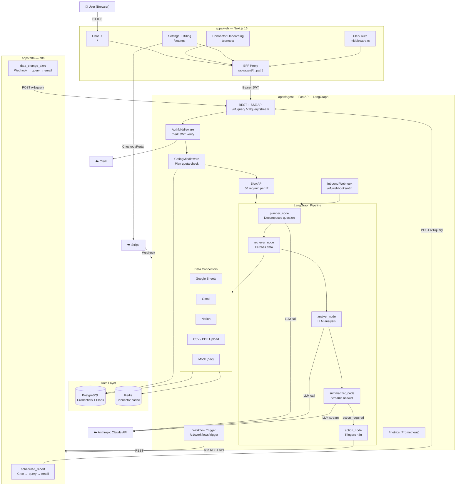

# Architecture Diagram

## Component Summary

| Component | Tech | Purpose |
|---|---|---|
| **web** | Next.js 16, Clerk, Tailwind | Chat UI, connector onboarding, billing settings |
| **agent** | FastAPI, LangGraph, Anthropic SDK | Multi-agent BI pipeline, REST + SSE API |
| **postgres** | PostgreSQL 16 | Encrypted connector credentials, user plans |
| **redis** | Redis 7 | Connector data cache (5-min TTL) |
| **n8n** | n8n (Docker) | Scheduled reports and data-change alerts |
| **Claude** | Anthropic API | LLM for planning, analysis, summarization |
| **Clerk** | Clerk SaaS | JWT-based user auth |
| **Stripe** | Stripe SaaS | Subscription billing, free/pro gating |
