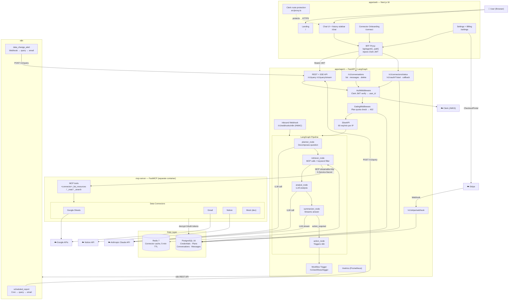

# Architecture Diagram

> Last updated: 2026-07-27 — reflects Phase 9 (security hardening). The `mcp-server`
> is drawn as its own service because it is a separate container with its own trust
> boundary, not a module inside the agent.

```mermaid
graph TD
    User["👤 User (Browser)"]

    subgraph Web ["apps/web — Next.js 16"]
        Landing["Landing\n/"]
        UI["Chat UI + history sidebar\n/chat"]
        Connect["Connector Onboarding\n/connect"]
        Settings["Settings + Billing\n/settings"]
        BFF["BFF Proxy\n/api/agent/[...path]\ninjects Clerk JWT"]
        Clerk["Clerk route protection\nsrc/proxy.ts"]
    end

    subgraph Agent ["apps/agent — FastAPI + LangGraph"]
        API["REST + SSE API\n/v1/query  /v1/query/stream"]
        Convos["/v1/conversations\nlist · messages · delete"]
        ConnStatus["/v1/connectors/status\n/v1/oauth/*/start · callback"]
        Webhook["Inbound Webhook\n/v1/webhooks/n8n  (HMAC)"]
        Workflows["Workflow Trigger\n/v1/workflows/trigger"]
        StripeHook["/v1/stripe/webhook"]
        Metrics["/metrics (Prometheus)"]

        Auth["AuthMiddleware\nClerk JWT verify → user_id"]
        Gating["GatingMiddleware\nPlan quota check → 402"]
        RateLimit["SlowAPI\n60 req/min per IP"]

        subgraph Graph ["LangGraph Pipeline"]
            Planner["planner_node\nDecomposes question"]
            Retriever["retriever_node\nMCP calls + keyword filter"]
            Analyst["analyst_node\nLLM analysis"]
            Summarizer["summarizer_node\nStreams answer"]
            Action["action_node\nTriggers n8n"]
        end
    end

    subgraph MCPSvc ["mcp-server — FastMCP (separate container)"]
        MCPServer["MCP tools\n&lt;connector&gt;_list_resources / _read / _search"]

        subgraph Connectors ["Data Connectors"]
            Sheets["Google Sheets"]
            Gmail["Gmail"]
            Notion["Notion"]
            Mock["Mock (dev)"]
        end
    end

    subgraph Data ["Data Layer"]
        PG[("PostgreSQL 16\nCredentials · Plans\nConversations · Messages")]
        Redis[("Redis 7\nConnector cache, 5-min TTL")]
    end

    subgraph Automation ["n8n"]
        ScheduledReport["scheduled_report\nCron → query → email"]
        DataAlert["data_change_alert\nWebhook → query → email"]
    end

    Claude["☁️ Anthropic Claude API"]
    Stripe["☁️ Stripe"]
    ClerkSvc["☁️ Clerk (JWKS)"]
    Google["☁️ Google APIs"]
    NotionSvc["☁️ Notion API"]

    User -->|HTTPS| Landing
    User --> UI
    UI --> BFF
    Connect --> BFF
    Settings --> BFF
    Clerk -.protects.-> UI
    BFF -->|Bearer JWT| API
    BFF --> Convos
    BFF --> ConnStatus

    API --> Auth --> Gating --> RateLimit --> Graph
    Convos --> Auth
    ConnStatus --> Auth
    Webhook --> Graph

    Planner -->|LLM call| Claude
    Analyst -->|LLM call| Claude
    Summarizer -->|LLM stream| Claude
    Planner --> Retriever --> Analyst --> Summarizer
    Summarizer -->|action_required| Action
    Action --> Workflows
    Workflows -->|n8n REST API| Automation

    Retriever -->|"MCP streamable-http<br/>X-Service-Secret"| MCPServer
    MCPServer --> Connectors
    Retriever <--> Redis
    Connectors -->|"decrypt OAuth tokens"| PG
    Sheets --> Google
    Gmail --> Google
    Notion --> NotionSvc

    Graph --> PG
    Gating --> PG
    Auth --> ClerkSvc
    ConnStatus --> PG

    Settings -->|Checkout/Portal| Stripe
    Stripe -->|Webhook| StripeHook
    StripeHook --> PG

    ScheduledReport -->|POST /v1/query| API
    DataAlert -->|POST /v1/query| API
```

## Component Summary

| Component | Tech | Purpose |
|---|---|---|
| **web** | Next.js 16, Clerk, Tailwind | Landing, chat UI + history, connector onboarding, billing settings |
| **agent** | FastAPI, LangGraph, Anthropic SDK | Multi-agent BI pipeline, REST + SSE API; MCP client |
| **mcp-server** | FastMCP (MCP Python SDK) | Serves connectors as MCP tools over streamable-http |
| **postgres** | PostgreSQL 16 | Encrypted connector credentials, user plans, conversation history |
| **redis** | Redis 7 | Connector data cache (5-min TTL) |
| **n8n** | n8n (Docker) | Scheduled reports and data-change alerts |
| **Claude** | Anthropic API | LLM for planning, analysis, summarization |
| **Clerk** | Clerk SaaS | JWT-based user auth |
| **Stripe** | Stripe SaaS | Subscription billing, free/pro gating |

## Trust Boundaries

| Boundary | Control |
|---|---|
| Browser → web | Clerk session; `src/proxy.ts` protects everything except `/`, `/sign-in`, `/sign-up`, `/api/billing/checkout`, `/api/agent/v1/oauth/*` |
| web → agent | BFF injects `Authorization: Bearer <clerk-jwt>` **server-side**; the browser never holds the agent token |
| agent request handling | `AuthMiddleware` verifies the JWT against Clerk's JWKS and sets `request.state.user_id`. Endpoints use only this value — never a `?user_id=` query param |
| agent → mcp-server | Shared `MCP_SERVICE_SECRET` sent as `X-Service-Secret`, verified with `hmac.compare_digest`. **The MCP tools trust their `user_id` argument**, so the server must never be publicly reachable |
| mcp-server → SaaS APIs | Per-user OAuth tokens, Fernet-encrypted at rest, resolved from Postgres by the connector itself. Raw tokens never cross the MCP boundary — only `user_id` does |
| n8n → agent | HMAC signature over the payload using `WEBHOOK_SECRET` |
| Stripe → agent | Stripe signature verification using `STRIPE_WEBHOOK_SECRET` |
| Production startup | `Settings._require_secure_secrets_in_production` refuses to boot if `CREDENTIAL_ENCRYPTION_KEY`, `WEBHOOK_SECRET`, or `MCP_SERVICE_SECRET` is missing or still the committed dev default |

> For a step-by-step trace of each operation through these components — including the
> exact call order, cache lookups, and failure paths — see [`docs/DATAFLOW.md`](../DATAFLOW.md).

## Known Architectural Gaps

- **No RAG.** `retriever_node` reads every resource a connector exposes and keeps the rows with the highest keyword overlap (cap: 60 rows / 15 text chunks). There is no ingest step, no chunking, no embedding, no vector store, and no citations. See Phase 10 in [`docs/PLAN.md`](../PLAN.md).
- **OAuth state is in-process.** `app/api/oauth.py` holds pending flows in a module-level dict, so it does not survive a restart and breaks with more than one worker. Needs Redis before any multi-instance deploy.
- **No CI and no deployment.** There is no `.github/` directory and no hosting target configured.
- **`AuthMiddleware` blanket-401s unauthenticated routes in production.** It has no exempt-path set, so with `APP_ENV=production` the OAuth callbacks, Stripe webhook, n8n webhook, `/health`, and `/metrics` all return 401 before their own signature checks run. Verified, with the full table, in [`docs/DATAFLOW.md`](../DATAFLOW.md#11-known-breaks-in-production).
